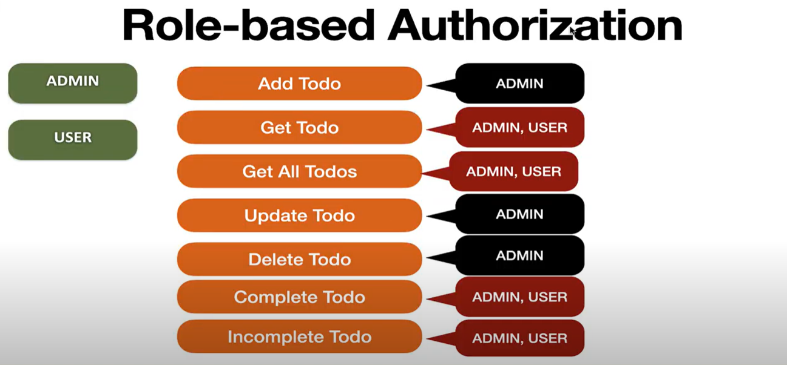
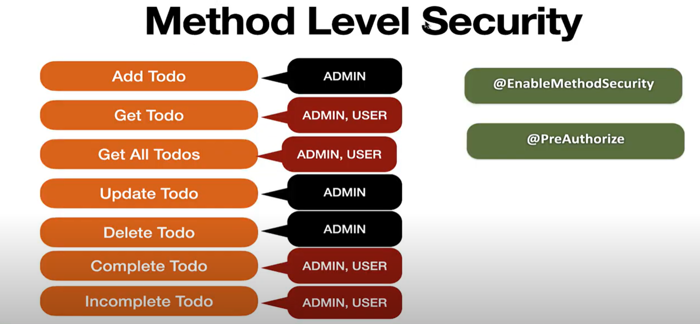

# Getting Started

## Requirement 1 - Build REST APIs

Build REST APIs for Todo Management Project.

User should able perform below operations:

- Add Todo
- Get Todo
- Get All Todo
- Update Todo
- Delete Todo
- Complete Todo
- In-complete Todo

## Requirement 2 - Secure the REST APIs using Role-based Authorization

### User Roles:
- ADMIN
- USER

### Operation user can access
- Add Todo - ADMIN
- Get Todo - ADMIN, USER
- Get All Todos - ADMIN, USER
- Update Todo - ADMIN
- Deleted Todo - ADMIN
- Complete Todo - ADMIN, USER
- Incomplete Todo - ADMIN, USER

## Technology Stack
- Spring Boot 3
- Spring Security 6
- Spring Data JPA (Hibernate 6)
- MySQL Database
- IntelliJ IDEA
- Maven
- Postman Client

## Spring Boot Application Follow Architecture 

## Using ModelMapper Library

## Using Model Mapper Library
> https://modelmapper.org/