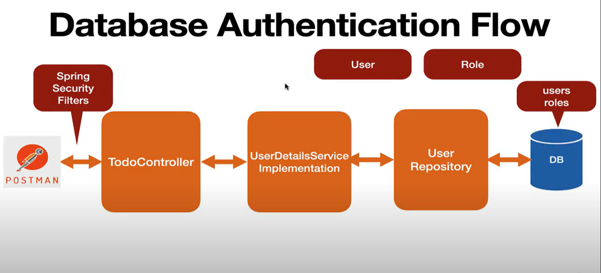

# Getting Started

## What you will learn

- Authentication and Authorization
- Spring Security Overview
- How to Add Spring Security to Spring Boot App
- Spring Boot Autoconfiguration for Spring Security
- Form based authentication
- Basic authentication
- In-memory authentication
- Secure REST APIs using Role-based authorization (Todo Management Project) • Secure REST APIs using Method level
  security (Todo Management Project)
- Database authentication (Todo Management Project)
- How Database authentication works

## Authentication VS Authorization

## Authentication

Authentication is the process of verifying the identity of a user or system attempting to access a resource.
Authentication Examples:

- Password-based authentication: A user enters their username(email) and password to access their email account (Ex:
  Gmail, LinkedIn, Facebook).
- Biometric authentication: A user scans their fingerprint to unlock their smartphone.
- Multi-factor authentication: A user enters a password and receives a one-time code via SMS to access their online
  banking account.
  Spring Security provides built-in support for authentication.

## Authorization

Authorization is the process of determining what actions an authenticated user or "system is allowed to perform on a
resource.

In simple term, authorization determines what actions they are allowed to perform once their identity has been verified.

**Authorization Example:
**[springboottodomanagementrestapiwithspringsecurity](src%2Fmain%2Fjava%2Forg%2Ftutorials%2Fspringboottodomanagementrestapiwithspringsecurity)

Role-based authorization: A user with a "manager" role can approve or reject employee leave requests, while a user with
an "employee" role can only submit leave requests.

**Spring Security provides built-in support for authorization.**

## Spring Security

1. Spring Security is a framework that provides authentication, authorization, and protection against common attacks.
   With first class support for securing both web and reactive applications, it is the de-facto standard for securing
   Spring-based applications.
2. Spring Security is used to secure web applications, REST APIs and Microservices.
3. Spring Security provides built-in support for both authentication and authorization.

## Spring Boot Auto Configuration for Spring Security

Spring Boot auto configures below features:

- spring-boot-starter-security starter that aggregates Spring Security-related dependencies together.
- Enables Spring Security's default configuration, which creates a servlet Filter as a bean named
  springSecurityFilterChain. This bean is responsible for all the security (protecting the application URLs, validating
  submitted username and passwords, redirecting to the login form, and so on) within your application.
- Form based authentication is enabled (Provides default login and logout features)
  Basic authentication is enabled
- Creates default user with a username as user and a randomly generated password that is logged to the console (Ex:
  8e557245-73e2-4286-969a-ff57fe326336).
- Spring boot provides properties to cusomize default user's username and password
- Protects the password storage with BCrypt algorithm
- CSRF attack prevention (enabled by default)

**permitAll();** HTTP GET request to URLs that match the pattern /api/v1/** will be allowed for all users, regardless of
whether they are authenticated or not. This is useful for public endpoints that should be accessible to everyone.

## Role-based Authorization

## Method Lave Security

## Database Authentication Flow

## User And Roles JPA Entities

## How Database Authentication Work

